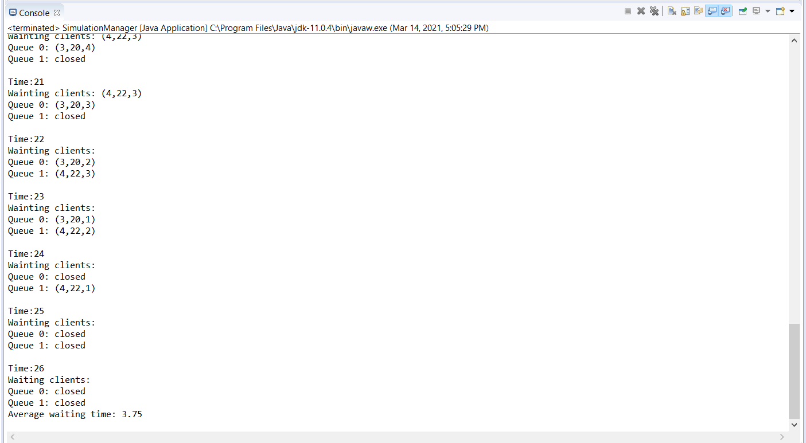

# Queues_Simulator
A simulation application aiming to analyse queuing based systems for
determining and minimizing clients’ waiting time. 

The application simulates (by defining a simulation time 𝑡𝑠𝑖𝑚𝑢𝑙𝑎𝑡𝑖𝑜𝑛) a series of N clients
arriving for service, entering Q queues, waiting, being served and finally leaving the queues. All
clients are generated when the simulation is started, and are characterized by three parameters: ID
(a number between 1 and N), 𝑡𝑎𝑟𝑟𝑖𝑣𝑎𝑙 (simulation time when they are ready to go to the queue; i.e.
time when the client finished shopping) and 𝑡𝑠𝑒𝑟𝑣𝑖𝑐𝑒 (time interval or duration needed to serve the
client by the cashier; i.e. waiting time when the client is in front of the queue). The application
tracks the total time spend by every customer in the queues and computes the average waiting
time. Each client is added to the queue with minimum waiting time when its 𝑡𝑎𝑟𝑟𝑖𝑣𝑎𝑙 time is greater
than or equal to the simulation time (𝑡𝑎𝑟𝑟𝑖𝑣𝑎𝑙 ≥ 𝑡𝑠𝑖𝑚𝑢𝑙𝑎𝑡𝑖𝑜𝑛).
The following data should be considered as input data read from a text file for the application:
- Number of clients (N);
- Number of queues (Q);
- Simulation interval (𝑡𝑠𝑖𝑚𝑢𝑙𝑎𝑡𝑖𝑜𝑛
𝑀𝐴𝑋 );
- Minimum and maximum arrival time (𝑡𝑎𝑟𝑟𝑖𝑣𝑎𝑙
𝑀𝐼𝑁 ≤ 𝑡𝑎𝑟𝑟𝑖𝑣𝑎𝑙 ≤ 𝑡𝑎𝑟𝑟𝑖𝑣𝑎𝑙
𝑀𝐴𝑋 );
- Minimum and maximum service time (𝑡𝑠𝑒𝑟𝑣𝑖𝑐𝑒
𝑀𝐼𝑁 ≤ 𝑡𝑠𝑒𝑟𝑣𝑖𝑐𝑒 ≤ 𝑡𝑠𝑒𝑟𝑣𝑖𝑐𝑒
𝑀𝐴𝑋 );
The output of the application is a text file containing a log of the execution of the application and
the average waiting time of the clients, as shown in the following example.

